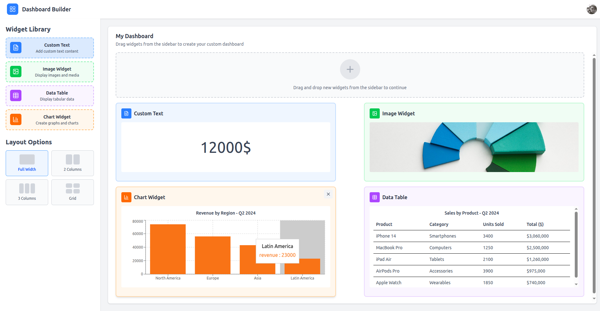

# Dashboard Builder 📊

A modern, drag-and-drop dashboard builder application that allows users to create custom dashboards with various widgets including text, images, data tables, and charts.



## 🚀 Features

- **Drag & Drop Interface**: Intuitive drag-and-drop functionality to add widgets to your dashboard
- **Multiple Widget Types**:
  - 📝 **Custom Text**: Add and style custom text content
  - 🖼️ **Image Widget**: Display images and media
  - 📊 **Data Table**: Show tabular data with customizable columns
  - 📈 **Chart Widget**: Create visual representations of your data
- **Flexible Layouts**: Choose from various layout options (Full Width, 2 Columns, 3 Columns, Grid)
- **Real-time Updates**: See changes instantly as you build your dashboard
- **Responsive Design**: Dashboards adapt to different screen sizes

## 🏗️ Project Structure

This is a monorepo containing both client and server applications:

```
dashboard-builder/
├── client/                 # React + TypeScript frontend
│   ├── src/               # Source code
│   ├── public/            # Static assets
│   ├── index.html         # Entry HTML file
│   ├── vite.config.ts     # Vite configuration
│   ├── tsconfig.json      # TypeScript configuration
│   └── package.json       # Client dependencies
│
└── server/                # Node.js backend
    ├── app.js            # Express application
    ├── service.js        # Business logic
    ├── data.json         # Sample data
    └── package.json      # Server dependencies
```

## 🛠️ Tech Stack

### Frontend

- **React** - UI library
- **TypeScript** - Type safety
- **Vite** - Build tool and dev server
- **ESLint** - Code linting
- **CSS Modules** - Component styling

### Backend

- **Node.js** - Runtime environment
- **Express** - Web framework
- **JSON** - Data storage (for demo purposes)

## 📦 Installation

### Prerequisites

- Node.js (v16 or higher)
- npm or yarn

### Setup Instructions

1. **Clone the repository**

   ```bash
   git clone <repository-url>
   cd dashboard-builder
   ```

2. **Install dependencies for both client and server**

   **Client:**

   ```bash
   cd client
   npm install
   ```

   **Server:**

   ```bash
   cd ../server
   npm install
   ```

## 🚀 Running the Application

### Development Mode

1. **Start the server** (from the server directory):

   ```bash
   cd server
   npm start
   ```

   The server will run on `http://localhost:3000` (or your configured port)

2. **Start the client** (from the client directory in a new terminal):
   ```bash
   cd client
   npm run dev
   ```
   The client will run on `http://localhost:5173` (Vite default)

### Production Build

**Build the client:**

```bash
cd client
npm run build
```

The built files will be in the `client/dist` directory.

## 📱 Usage

1. **Access the Dashboard Builder** by opening your browser to the client URL
2. **Widget Library** - Browse available widgets in the left sidebar:
   - Custom Text: Add headings, paragraphs, or any text content
   - Image Widget: Upload or link images
   - Data Table: Display structured data
   - Chart Widget: Create bar charts, line graphs, etc.
3. **Drag widgets** from the library to the dashboard canvas
4. **Configure widgets** by clicking on them after placement
5. **Choose layout options** from the Layout Options panel

## 🔧 Configuration

### Client Configuration

Edit `client/vite.config.ts` to modify:

- Port settings
- Proxy configuration for API calls
- Build output directory

### Server Configuration

Edit `server/app.js` to modify:

- Server port
- CORS settings
- API endpoints

## 📝 API Endpoints

The server provides the following RESTful endpoints:

### Health Check

```
GET  /  - Returns "Healthy app!" to verify server is running
```

### Widget Management

```
GET    /widgets              - Retrieve all widgets
POST   /widgets              - Add a new widget
DELETE /widgets/:id          - Delete a specific widget by ID
```

### Data Streaming

```
GET    /data-stream/:identifier  - Get data stream for a specific widget
```

### Request/Response Examples

**Get All Widgets**

```bash
GET /widgets
Response: {
  "data": [
    {
      "id": "widget-1",
      "type": "chart",
      "config": {...}
    }
  ]
}
```

**Add Widget**

```bash
POST /widgets
Body: {
  "type": "chart",
  "config": {
    "title": "Revenue Chart",
    "data": [...]
  }
}
Response: {
  "message": "Widget added successfully"
}
```

## 🔧 Environment Variables

Create a `.env` file in the server directory:

```env
PORT=3000  # Server port (optional, defaults to 3000)
```

## 🐛 Known Issues

- Widget persistence requires backend implementation
- Image upload functionality needs to be connected to a storage service
- Real-time collaboration features are not yet implemented

## 🚧 Planned Improvements

### High Priority

1. **Database Integration**

   - Replace JSON file storage with a proper database (PostgreSQL/MongoDB)
   - Implement proper data persistence
   - Add user authentication and multi-user support

2. **Enhanced Layout System**

   - Save widgets in specific layout configurations (not just rows)
   - Support nested layouts and custom grid systems
   - Implement responsive breakpoints for different screen sizes

3. **Widget Enhancements**
   - Add more widget types (KPI cards, maps, filters)
   - Implement widget interconnectivity (filter affects multiple widgets)
   - Add real-time data updates via WebSockets

### Future Features

- Export dashboards as PDF/PNG
- Template library for quick dashboard creation
- Widget marketplace for custom widgets
- Performance optimizations for large datasets
- Undo/redo functionality
- Keyboard shortcuts for power users

**Happy Dashboard Building! 🎨**
